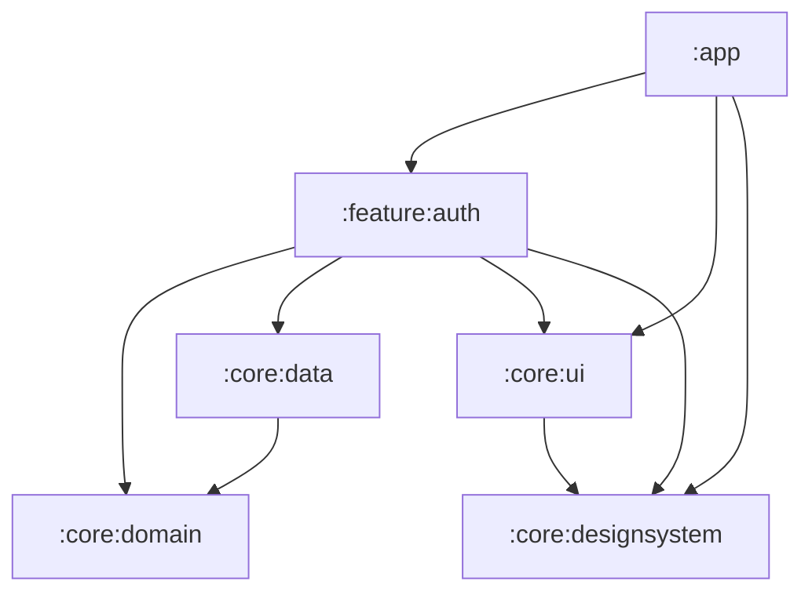
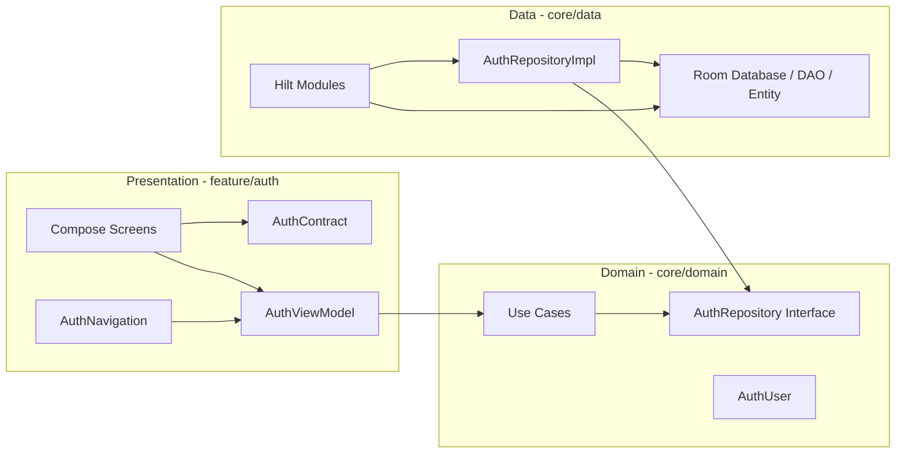
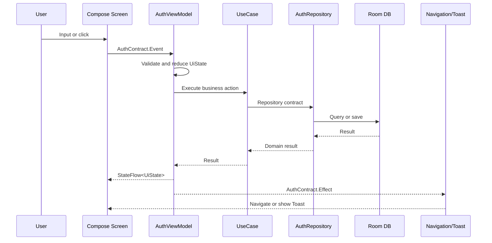
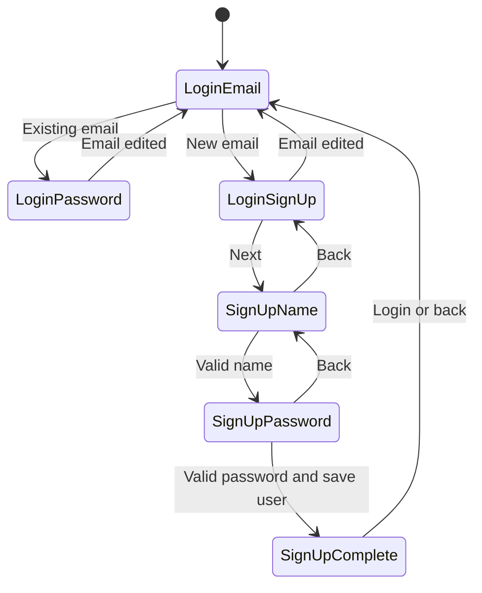
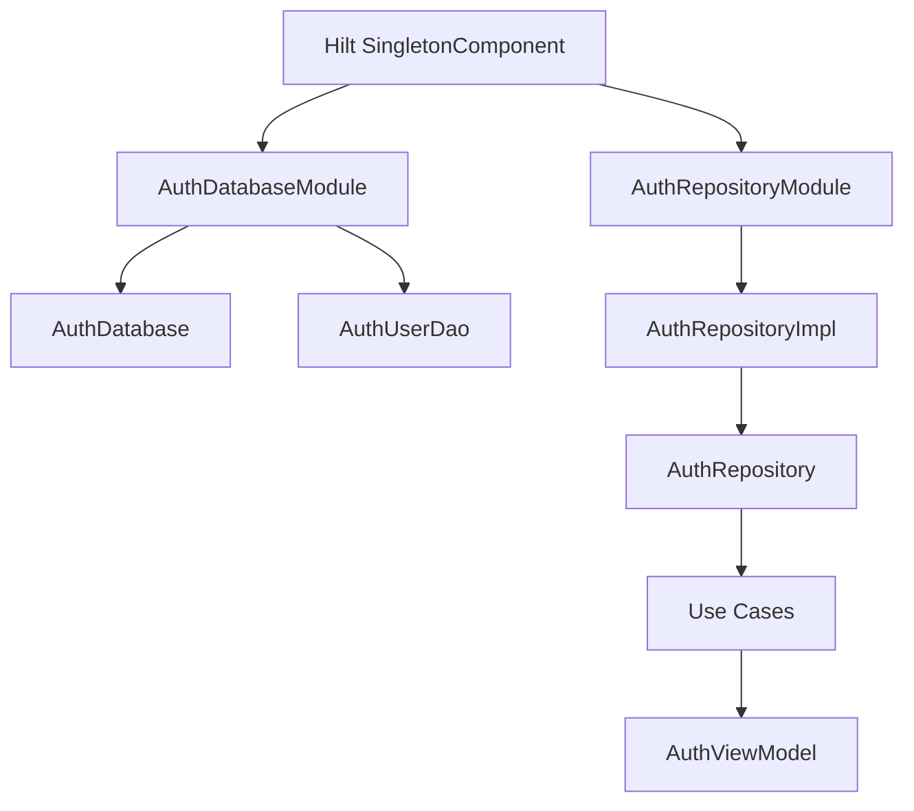

# Deepfine Android

Deepfine은 Jetpack Compose 기반의 Android 인증 예제 프로젝트입니다.
현재 구현 범위는 이메일 기반 로그인/회원가입 플로우이며, 로컬 영속성 저장소로 Room Database를 사용합니다.

## 핵심 기술

- UI: Jetpack Compose
- 아키텍처: Clean Architecture
- 상태 관리: MVI(Model-View-Intent)
- DI: Hilt
- 영속성 저장소: Room Database
- 화면 전환: Navigation3

## 모듈 구성

의존성은 `app -> feature -> core` 방향으로 흐릅니다.
비즈니스 규칙은 `core:domain`, 실제 저장소 구현은 `core:data`, 공통 UI 자산은 `core:ui`와 `core:designsystem`에 둡니다.



| 모듈 | 책임 |
| --- | --- |
| `:app` | 앱 진입점 |
| `:feature:auth` | 인증 화면, MVI, 네비게이션 |
| `:core:domain` | 모델, repository contract, use case |
| `:core:data` | Room, repository 구현체, data DI |
| `:core:ui` | 공통 Compose UI 컴포넌트 |
| `:core:designsystem` | 테마, 타이포그래피, 컬러 토큰 |

핵심 규칙은 단순합니다.

- 화면은 `feature:auth`에 둡니다.
- 비즈니스 판단은 `core:domain`의 use case로 위임합니다.
- Room과 Hilt data binding은 `core:data`에만 둡니다.

## Clean Architecture



의존성 방향은 바깥 계층이 안쪽 계층을 바라보도록 구성했습니다.

- `feature:auth`는 화면 상태와 사용자 이벤트를 처리하고, 비즈니스 판단은 use case에 위임합니다.
- `core:domain`은 Android UI나 Room 구현을 알지 않습니다.
- `core:data`는 domain의 `AuthRepository`를 구현하고, Room을 통해 실제 데이터를 저장합니다.
- Repository 구현체 이름은 `AuthRepositoryImpl`로 두어 domain contract와 구현체의 관계를 명확히 했습니다.

## MVI 패턴

Auth feature는 `AuthContract`를 중심으로 MVI 구조를 구성합니다.



### Contract 역할

| 타입 | 역할 |
| --- | --- |
| `UiState` | 화면이 렌더링하는 단일 상태. 이메일, 이름, 비밀번호, validation, loading 상태를 포함합니다. |
| `Event` | 화면에서 ViewModel로 전달되는 사용자 의도입니다. 입력 변경, 제출, 초기화 등을 표현합니다. |
| `Effect` | 한 번만 처리되어야 하는 side effect입니다. 화면 전환과 Toast 메시지를 담당합니다. |
| `UiMessage` | Toast로 노출되는 사용자 메시지를 타입으로 관리합니다. |

## Auth Flow



`AuthNavigation`은 `AuthContract.Effect`를 수집해 Navigation3 back stack을 변경합니다.
화면 전환은 push 시 왼쪽, pop 시 오른쪽 방향으로 이동하도록 구성했습니다.

## DI 구성



- `AuthDatabaseModule`은 `AuthDatabase`와 `AuthUserDao`를 제공합니다.
- `AuthRepositoryModule`은 `AuthRepositoryImpl`을 domain의 `AuthRepository`에 바인딩합니다.
- 유스케이스는 생성자 주입을 통해 domain repository contract를 전달받습니다.
- `AuthViewModel`은 Hilt를 통해 유스케이스를 주입받습니다.

## 주요 패키지

```text
app/
  src/main/java/com/wonjo/deepfine/

feature/auth/
  src/main/java/com/wonjo/deepfine/auth/
    login/
    signup/
    component/
    AuthContract.kt
    AuthNavigation.kt
    AuthViewModel.kt

core/domain/
  src/main/java/com/wonjo/deepfine/core/domain/auth/
    model/
    repository/
    usecase/

core/data/
  src/main/java/com/wonjo/deepfine/core/data/auth/
    local/
    di/
    AuthRepositoryImpl.kt
    PasswordHasher.kt

core/ui/
  src/main/java/com/wonjo/deepfine/core/ui/

core/designsystem/
  src/main/java/com/wonjo/deepfine/core/designsystem/
```

## 검증

주요 변경 후 다음 명령으로 컴파일을 확인합니다.

```bash
./gradlew :app:compileDebugKotlin
```

Windows 환경에서는 다음 명령을 사용합니다.

```powershell
.\gradlew.bat :app:compileDebugKotlin
```
